# Enterprise SOC Home Lab - Wazuh SIEM, Active Directory & Multi-OS Agent Monitoring

This repository documents an operational enterprise-style SOC home lab built inside an isolated VMware network. The lab combines Active Directory, Windows endpoints, Linux endpoints, internal mail services, Wazuh SIEM/XDR, and controlled adversary-simulation infrastructure.

> **Security note:** Public screenshots are curated. Password/setup screens, generated Wazuh credentials, private keys, certificates, installer archives, and mailbox secrets are not included.

## Current Status

The lab is operational as a multi-OS monitored environment. Wazuh agents are deployed on the operating systems that generate endpoint telemetry, while Kali is reserved as the controlled simulation node.

| Component | Status |
|---|---|
| Active Directory / DNS | Deployed on `ORACLE-DC1` |
| Windows Server agent | Deployed on `windows-server-dc` / `ORACLE-DC1` |
| Windows 11 agent | Deployed on `MIKE` / `windows-11-vm` |
| Windows 10 agent | Deployed on `CASSIE-PC` / `windows-10-vm` |
| Debian agent | Deployed on `corp-web` |
| Xubuntu agent | Deployed on `admin-node` |
| hMailServer / Thunderbird | Deployed and validated for internal IMAP/SMTP flow |
| Wazuh Dashboard | Operational for centralized event review and threat hunting |

## Lab Objective

Build a realistic enterprise training environment that can generate and centralize security telemetry for SOC analysis:

- Active Directory identity infrastructure through `oracle.local`
- Windows 10/11 domain workstations and Windows Server domain controller telemetry
- Linux endpoint telemetry from Debian and Xubuntu systems
- Internal corporate mail flow with hMailServer and Thunderbird
- Wazuh SIEM/XDR event ingestion, parsing, and dashboard review
- Kali Linux node for controlled password spraying, brute-force, and privilege-escalation simulations inside the isolated lab

## Architecture

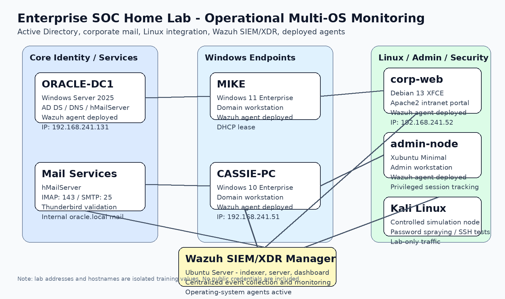

| Asset | Operating System | Role | Monitoring |
|---|---|---|---|
| `ORACLE-DC1` | Windows Server 2025 | AD DS, DNS, hMailServer | Wazuh agent deployed |
| `MIKE` | Windows 11 Enterprise | Domain workstation | Wazuh agent deployed |
| `CASSIE-PC` | Windows 10 Enterprise | Domain workstation | Wazuh agent deployed |
| `corp-web` | Debian 13 XFCE | Apache2 intranet / Linux AD-integrated host | Wazuh agent deployed |
| `admin-node` | Xubuntu Minimal | Administrator workstation | Wazuh agent deployed |
| `Kali Linux` | Kali | Controlled simulation node | Lab traffic source |
| `Wazuh Manager` | Ubuntu Server | SIEM/XDR manager, indexer, dashboard | Central monitoring node |

## Evidence Highlights

### Active Directory identity and endpoint setup

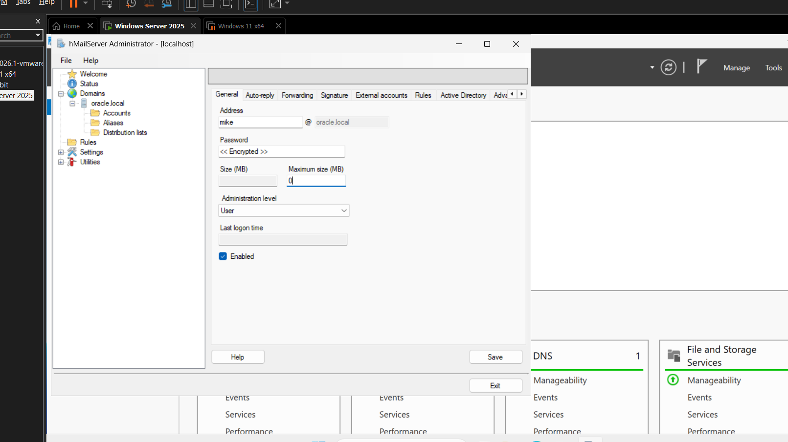

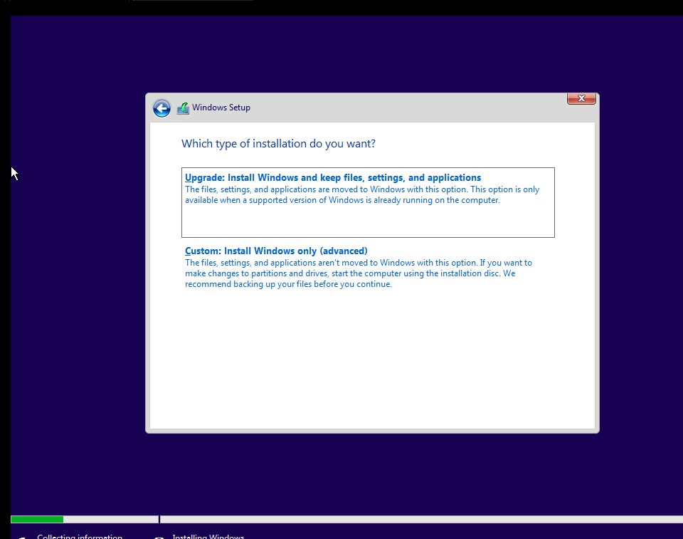

### Corporate mail service and Thunderbird verification

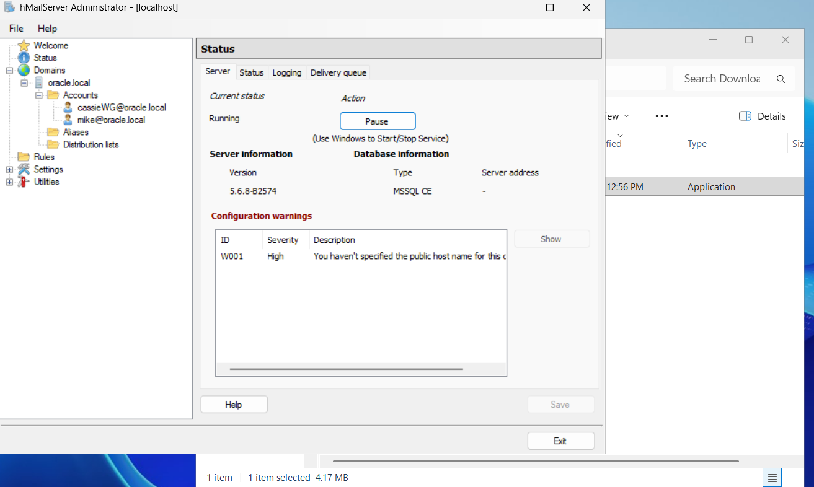

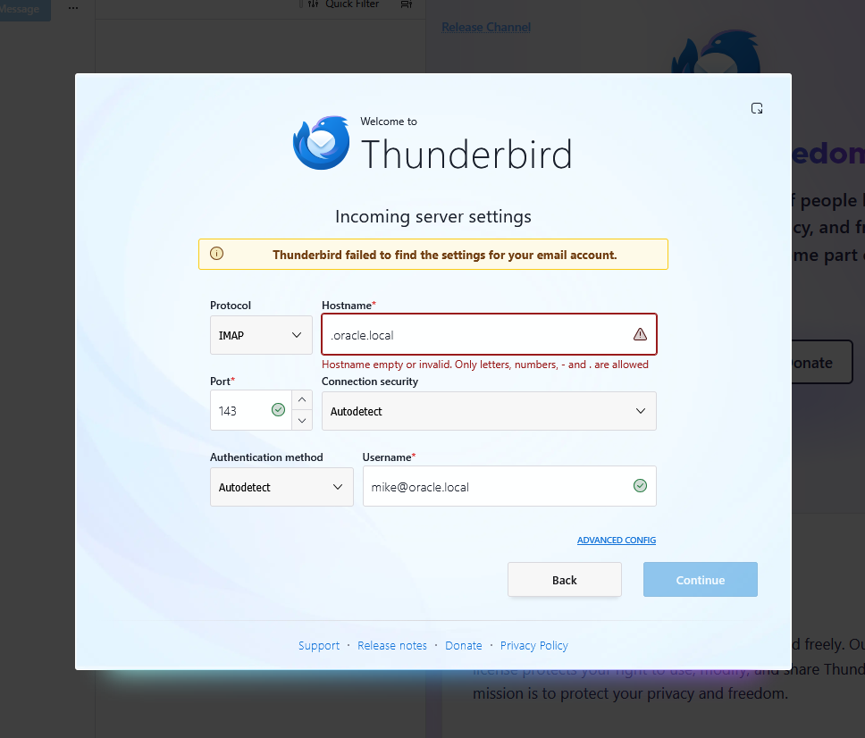

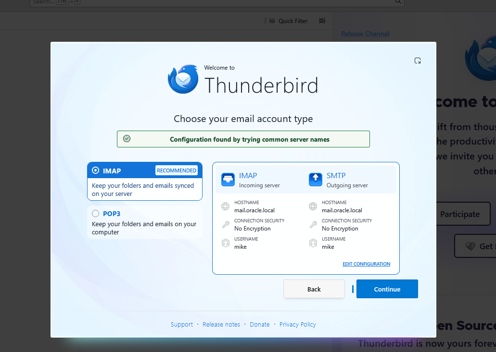

### Linux corporate web endpoint and AD integration

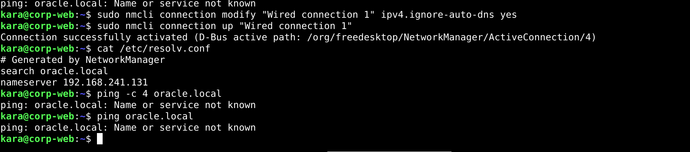

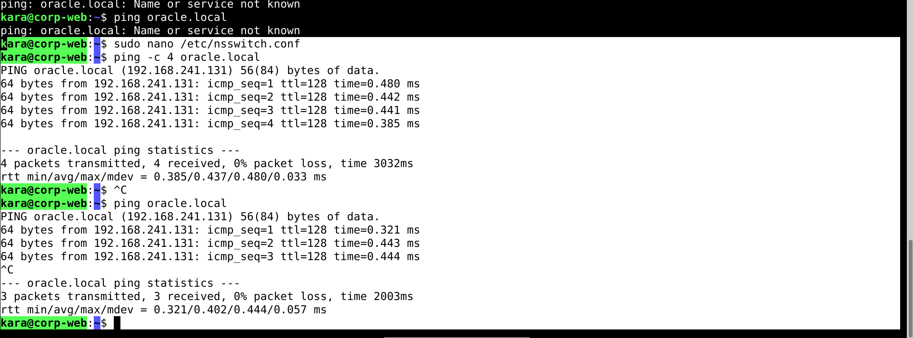

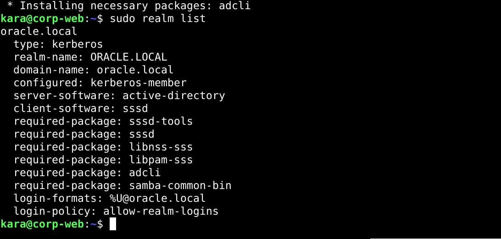

### Wazuh agent deployment on operating systems

The Wazuh deployment is documented as an endpoint-monitoring layer, not as a pending task. Agents were deployed across the Windows and Linux operating systems used in the lab.

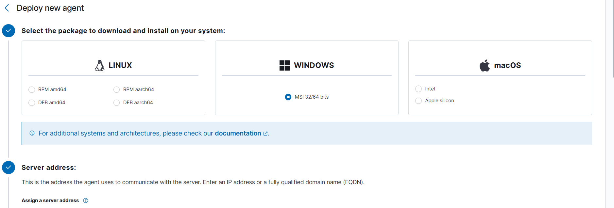

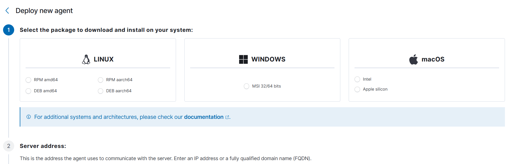

### Wazuh telemetry and threat hunting

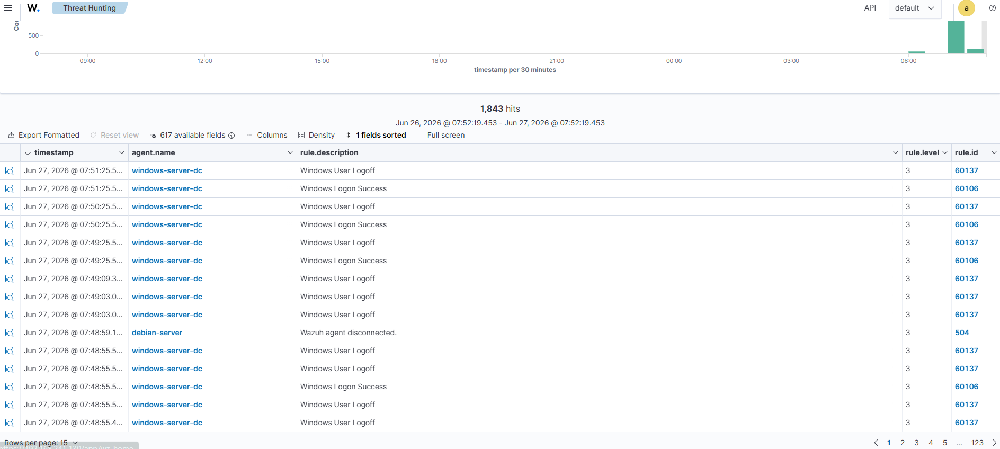

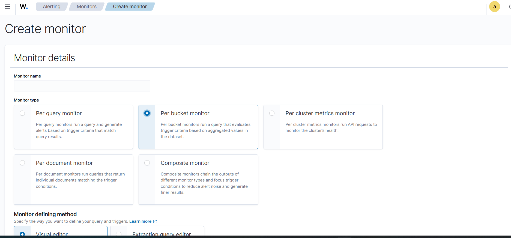

## Agent Deployment Summary

### Windows ecosystem

Wazuh agents are deployed to Windows Server, Windows 10, and Windows 11 endpoints using the Wazuh Windows MSI package. The environment uses clear agent names so telemetry can be mapped to the correct operating system and asset role.

Example target names:

```text
windows-server-dc
windows-10-vm
windows-11-vm
```

### Linux ecosystem

Wazuh agents are deployed on Linux endpoints using the Debian/Ubuntu-compatible package flow. The Linux assets provide syslog, authentication, service, package, and file-integrity telemetry.

Example target names:

```text
corp-web
admin-node
```

## Current Telemetry Baseline

The lab is producing operational telemetry inside Wazuh:

- Windows logon/logoff events from domain systems
- Windows Event Log parsing into Wazuh event fields
- Linux authentication and service activity from Debian/Xubuntu endpoints
- Wazuh agent availability events, including disconnect/reconnect style monitoring
- Baseline event volume suitable for rule tuning and noise reduction

## Detection Work Next

The installation and agent phase is not the roadmap anymore. The next phase is detection validation:

- Configure SMTP alert routing through hMailServer and Thunderbird
- Write custom Wazuh rules for AD account creation and privileged group changes
- Simulate password spraying against domain users inside the isolated lab
- Simulate SSH brute-force against Linux endpoints
- Track privilege-escalation indicators such as local admin changes, service creation, scheduled tasks, sudoers changes, and suspicious PowerShell
- Document each case with event evidence, Wazuh alert data, analyst decision, and remediation recommendation

## Full PDF Report

The full report is available here:

- [`docs/Enterprise_SOC_Home_Lab_Report.pdf`](docs/Enterprise_SOC_Home_Lab_Report.pdf)

## Repository Structure

```text
.
├── README.md
├── docs/
│   ├── Enterprise_SOC_Home_Lab_Report.pdf
│   ├── AGENT_DEPLOYMENT.md
│   ├── DETECTION_CASES.md
│   └── SCREENSHOT_MANIFEST.md
├── screenshots/
│   ├── 01_network_topology_operational.png
│   ├── 11_wazuh_agent_deploy_windows.png
│   ├── 12_wazuh_agent_deploy_linux.png
│   └── 13_wazuh_threat_hunting_events.png
└── notes/
    └── next_detection_work.md
```
